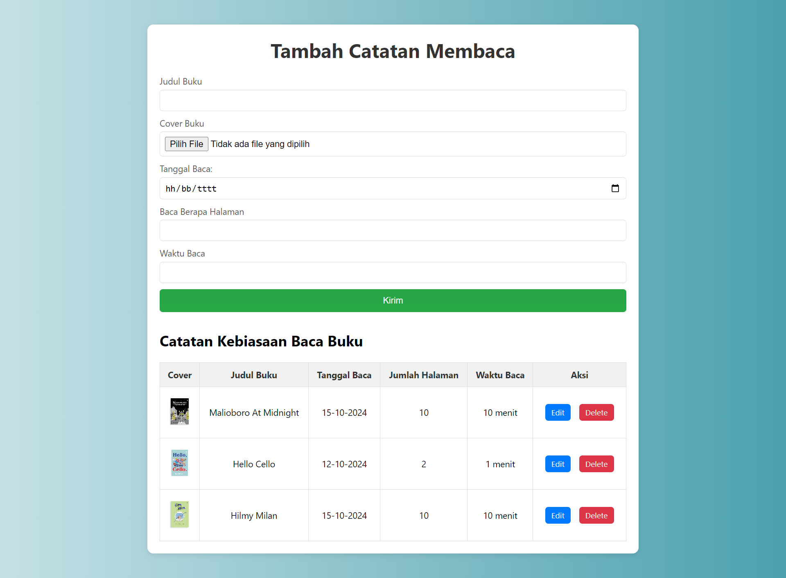

# Aplikasi Kebiasaan Baca Buku

Aplikasi Kebiasaan Baca Buku adalah aplikasi sederhana berbasis web yang digunakan untuk mencatat dan melacak kebiasaan membaca buku. Pengguna dapat menambahkan catatan buku yang sedang dibaca, termasuk judul buku, halaman yang dibaca per hari, serta mengunggah gambar sampul buku. Aplikasi ini menggunakan SQLite3 sebagai basis data dan mendukung operasi CRUD (Create, Read, Update, Delete) untuk mengelola data buku.

# Fitur Aplikasi

1. Mencatat Buku: Pengguna dapat mencatat judul buku yang sedang dibaca, halaman yang telah dibaca, dan tanggal membaca.
1. Mengunggah Gambar Sampul Buku: Setiap buku yang dicatat dapat dilengkapi dengan gambar sampul yang diunggah oleh pengguna.
1. Menampilkan Daftar Buku: Pengguna dapat melihat daftar buku yang telah dicatat dalam bentuk tabel dengan informasi judul buku, halaman yang dibaca, dan tanggal.
1. Edit Buku: Pengguna dapat mengedit judul buku, jumlah halaman yang dibaca, serta gambar sampul buku.
1. Hapus Buku: Buku yang tidak diinginkan lagi dapat dihapus dari daftar.